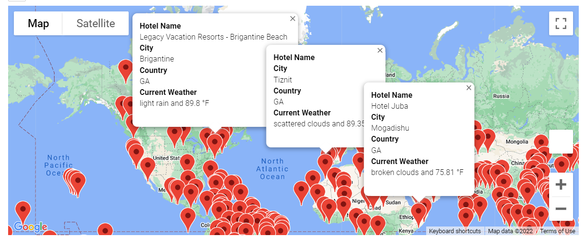
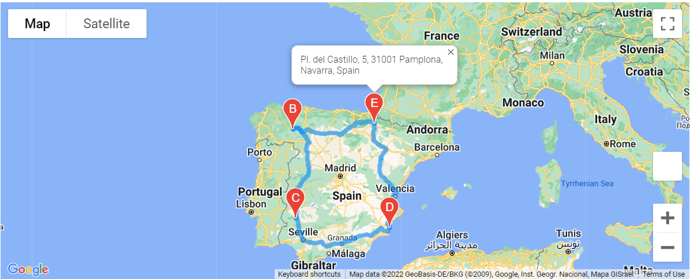
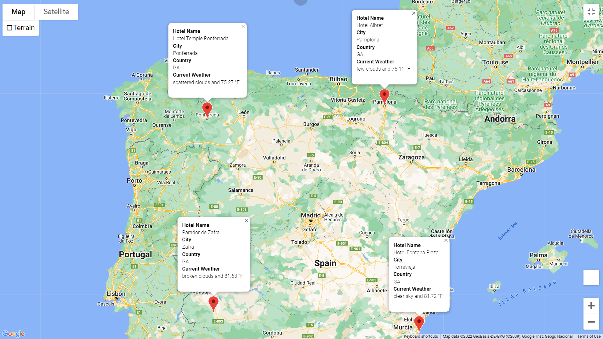

# World_Weather_Analysis_Challenge
The purpose of this analysis was the following:
## Deliverable 1: Retrieve Weather Data
### 1.	Create a set of 2,000 random latitudes and longitudes and the nearest city to each of those random locations
### 2.	Using the OpenWeatherMap API, create a dataframe (and an exported csv file) after retrieving the following about each location:
#### o	Latitude and longitude
#### o	Maximum temperature
#### o	Percent humidity
#### o	Percent cloudiness
#### o	Wind speed
#### o	Weather description (for example, clouds, fog, light rain, clear sky)

## Deliverable 2: Create a Customer Travel Destinations Map
### 1.	Create a “vacation search” from the exported csv file in Deliverable #1  and  produce a query based on the customer’s minimum and maximum temperature criteria for their vacation.
### 2.	Find a possible hotel in each of the cities with the desired weather temperatures and load the info into a new DataFrame (and export to a csv). 
### 3.	Using gmaps, create a map that shows all the cities fitting the customer’s criteria with pop-up markers for each city on the map.

## Deliverable 3: Create a Travel Itinerary Map
### 1.	Create a “vacation itinerary”  of 4 cities that a customer might want to visit from the exported csv file in Deliverable #2.  
### 2.	Show a possible route to take to visit all the cities on a map with pop up markers for each city on the trip.
### 3.	Update the map in deliverable #2 to show just the 4 cities with hotel name, city, country, and current weather. 

